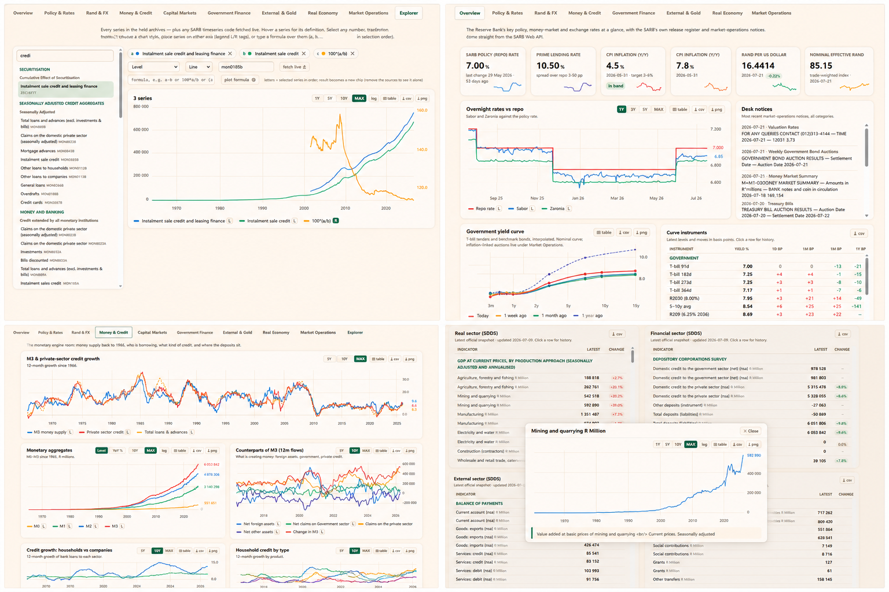

# SARB Data Explorer

A single-file, HTML dashboard over the **South African Reserve Bank Web API** —
A modernisation of a personal Excel based dashboard.
Serves the complete public dataset. Companion to the SA CPI dashboard,
built on the same pattern: one HTML file, one PowerShell updater, one data sidecar.

**Updated 23 July 2026 to include additional +2000 account codes in the Explorer tab**

**[Click here to try the SARB Dashboard →](https://za-macro.pages.dev)** **https://za-macro.pages.dev** 

**[Click here to try the SA CPI Dashboard →](https://sacpi.pages.dev)** **https://sacpi.pages.dev** 

> Every chart has a table view, CSV and PNG export. Tables export to CSV and rows with a series code click through to a history pop-up
>  If you'd like to setup your own version see **[SETUP.md](SETUP.md)**
> Note: Intial load might take a few minutes if you've cloned the repo and are running it locally. Refresh the page once the powershell closes.





```
SARB Dashboard/
├── SARB_Dashboard.html      the whole app (open it directly — file:// works)
├── Update-SARB-Data.ps1     pulls the SARB API into data/live-data.js
├── Open SARB Dashboard.bat  opens the app, then refreshes data in the background
├── Deploy-Pages.ps1         one-command publish to za-macro.pages.dev
├── _redirects               Pages rewrite (/ → /SARB_Dashboard)
└── data/
    └── live-data.js         ~6 MB offline archive (window.SARB_LIVE = {...})
```

## What's in it

| Tab | Contents |
|---|---|
| **Overview** | Repo / prime / CPI / PPI / rand tiles with sparklines, **interpolated government yield curve** (T-bill tenders + 5 real maturity buckets 0–3y/3–5y/5–10y/10–15y/20–30y, sourced from the Quarterly Bulletin download facility — not a bootstrapped zero curve, caveat noted in-app; today vs 3m/1y/5y snapshots, instrument table in bps), overnight rates vs repo, live market-rates board, release register, desk notices |
| **Policy & Rates** | Repo & prime daily history, **real policy rate** (repo − CPI), the SARB's 60-year real prime series, NCD curve, T-bill vs repo spread, CPD rates |
| **Rand & FX** | Majors since 1980 (log scale), NEER vs REER since 1970, 30-day realised volatility, bilateral-vs-basket divergence, full 33-pair FX board with rand-direction colouring |
| **Money & Credit** | M3 & private credit growth since 1966, aggregates since 1965, counterparts of M3 (12m flows), household-vs-corporate borrowing, credit by product, deposits by sector, securitisation |
| **Capital Markets** | Long-bond yield **since 1949**, daily benchmark yields, 10y−repo curve slope, JSE turnover, non-resident flows |
| **Government Finance** | Revenue vs expenditure (12m rolling), the deficit with seasonality stripped, financing mix, debt ratios |
| **External & Gold** | Reserves & liquidity position, import cover, current account, forex-market turnover by instrument, gold in rand vs dollar since 1960 |
| **Real Economy** | Business-cycle indicators since 1960, production **since 1946** (gold mining), sales momentum, GDP growth, CPI/PPI pipeline vs target band, all six IMF SDDS tables |
| **Market Operations** | Repo auctions, T-bill tenders, valuation rates, special announcements — parsed from the desk's own notices (23 categories) |
| **Explorer** | Every held series (**~2,570**, including the full ~2,320-code Quarterly Bulletin KBP catalogue) searchable with hover descriptions (+ matching glossary terms) and a **frequency badge** (Daily/Weekly/Monthly/Quarterly/Annual), unlimited overlays, Level / YoY / MoM / 12-m-sum / Index transforms, an arbitrary-formula engine over any selection (`(a-b)/c*100`, any number of series), **line / area / bar / scatter / stacked-bar / stacked-area** chart styles, per-series axis placement, and a box to live-fetch any SARB WebIndicators code |
| **Guide** | A field guide to the dashboard: what each tab covers, a "what each series measures" lookup across the full catalogue, and a searchable ~55-term glossary decoding the acronyms/institutional concepts the SARB's own series names lean on |

Every chart has crosshair tooltips, range buttons, a table view, CSV and PNG export.
Multi-series charts support **dual axes**: scales split automatically when magnitudes
differ wildly (NEER vs REER, gold in rand vs dollar, the 2021 vehicle-sales spike), and
every series carries an L/R tag in the legend to move it by hand. Tables export to CSV
and rows with a series code click through to a history pop-up. SDDS tables that carry two
genuinely different indicators under one identical label (no distinguishing description
from the SARB at all) are tagged — e.g. two "Grants" lines marked (receipts)/(payments),
IIP items marked (assets)/(liabilities). FT-paper light theme (matching the SA CPI
dashboard) plus dark; palettes validated for colour-vision deficiency.

## How data flows

Two layers, freshest wins:

1. **`data/live-data.js`** — written by `Update-SARB-Data.ps1`. Full offline archive:
   twelve statistical releases back to 1946–1965, 60+ deep daily/monthly series, SDDS
   tables, MCM notices. Loaded as a plain `<script src>`, so it works from `file://`.
2. **Live API calls** — unlike StatsSA, the SARB API sends
   `Access-Control-Allow-Origin: *`, so the page refreshes the fast-moving numbers
   (rates boards, FX, tails of daily series) straight from the browser, even opened
   from disk. The badge (top-right) shows which mode you're in.

## The updater

```powershell
.\Update-SARB-Data.ps1              # incremental (seconds — only re-pulls what changed)
.\Update-SARB-Data.ps1 -Force       # full re-download (~40 MB raw, several minutes)
.\Update-SARB-Data.ps1 -Install     # daily 18:30 scheduled task
.\Update-SARB-Data.ps1 -Uninstall   # remove the task
```

Incremental logic: the big archives are only re-downloaded when the SARB's own
release register (`ReleaseOfSelectedData`) shows a newer `LastPeriod` than what is
held; daily series fetch only their tail and merge. The KBP catalogue works the same
way — brand-new codes get a full history fetch, but every already-held code just gets
a small ~15-month top-up check merged onto its existing history, never a full re-fetch.
Failures keep last-known-good data per group — the file is never written in a
crippled state.

## SARB Web API endpoints used

Base: `https://custom.resbank.co.za/SarbWebApi`

| Endpoint | Data |
|---|---|
| `WebIndicators/HomePageRates` | headline rates board |
| `WebIndicators/CurrentMarketRates` | full market rates board |
| `WebIndicators/CPDRates` | Corporation for Public Deposits |
| `WebIndicators/HistoricalExchangeRatesDaily` / `Monthly` | FX boards (33 pairs, NEER/REER) |
| `WebIndicators/OtherIndicators` (+`/HistoricalDatesOfRateChanges`) | headline ratios, last repo/prime changes |
| `WebIndicators/ReleaseOfSelectedData` | release register |
| `WebIndicators/ReleaseOfSelectedData/MonthlyIndicatorsAll/{type}` | 12 archives: MRDMA, MRDBM, MRDIE, MRDFG, MRDCM, MRDEI, CDACSQ, CDACSM, CDASA, CDADS, CDACA, CDACM3 |
| `WebIndicators/ReleaseOfSelectedData/{Group}Graphs/{n}` | SARB's curated chart series |
| `WebIndicators/Shared/GetTimeseriesObservations/{code}/{from}/{to}` | deep history for **any** series code |
| `WebIndicators/EconFinDataForSA/Get{Real,Financial,External,Fiscal,Population}SectorData` | IMF SDDS tables |
| `MCM/Categories` + `MCM/Contributions/{id}` | money-market desk notices (XML payloads, parsed in-page) |

**Second data source — the Quarterly Bulletin download facility.** Some series the
SARB catalogs (credit-card activity, the government bond yield *maturity buckets*
0–3y/3–5y/5–10y/10–15y/20–30y used for the yield curve, and ~2,300 other codes) return
nothing at all through the WebIndicators endpoints above — not a code-format issue,
they're simply not exposed that way. They **are** reachable through a separate endpoint:

```
https://www.resbank.co.za/bin/sarb/custom/downloadfacility
  ?onlineDownload=sSRSData&sSRSDataTsCodes=<code1>,<code2>,...
  &sSRSDataFrequencyDescription=Monthly&sSRSDataStartDate=YYYY/MM/DD&sSRSDataEndDate=YYYY/MM/DD
```

No auth needed, but **no CORS header either** — fetched only by `Update-SARB-Data.ps1`
(or the optional Cloudflare Worker, see below), never straight from the browser. It sits
behind an F5 WAF that rejects the whole request once too many codes are packed into one
query string.

The full catalog — `kbp-manifest.json`, 2,320 codes built from the SARB's own "QB
TimeSeries Descriptions" Excel — is **2,318/2,320 held** (99.9%; the last 2
have no data at any frequency, confirmed directly):

- **The manifest's own Frequency column is wrong for a large share of codes.** A code
  tagged "Quarterly" can reliably 500 under that exact frequency and only ever return
  data under "Yearly" instead — this isn't random flakiness, it's 100% reproducible per
  code. The updater discovers and records each code's *proven-working* frequency (a
  `freq` field stored per series, not trusted from the manifest at fetch time going
  forward).
- **`Period` is an 8-digit `YYYYMMDD` integer with trailing components zero-padded, not
  omitted**, for coarser frequencies — a real day for Daily/Weekly codes, day=00 for
  Monthly, month=00+day=00 for Yearly. Parsing it as a fixed-width "YYYY-MM" regardless
  of frequency silently collapsed every day in a month into one duplicated bucket for
  Daily/Weekly data, and produced an invalid "YYYY-00" month for Yearly data that
  JavaScript then rolled back to December of the *prior* year. Both are fixed in
  `Compact-KBP` (and its JS mirror in the Worker) by reading the actual digits present.

### API gotchas (hard-won)

- **Archive values are South African locale strings**: comma is the *decimal*
  separator (`"361,9"`) and non-breaking space (U+00A0) the *thousands* separator
  (`"1 571"`). Both the updater and the page normalise before parsing. Same class
  of bug that once bit the CPI project — never trust default number parsing.
- `GetTimeseriesObservations/{code}` without dates returns only ~30 recent rows;
  the `{from}/{to}` form returns everything (USD/ZAR back to 1980, KBP codes to 1946).
- `HistoricalDatesOfRateChanges` returns only the *latest* change, despite the name —
  long rate history comes from the daily series instead.
- PowerShell 5.1: `ConvertFrom-Json` chokes on the 11 MB money-and-banking payload —
  the updater uses `JavaScriptSerializer`. Never build its input via `Sort-Object`
  (PSObject wrapping breaks `Serialize`); the writer also serialises key-by-key with
  a deep-clean fallback.

## Cloudflare Pages hosting

The site at **https://za-macro.pages.dev** is plain static hosting on Cloudflare's
**free tier** SARB's main API
sends `Access-Control-Allow-Origin: *`. The deployed page refreshes all of that straight
from the visitor's browser, and **self-heals stale archives**: on load it compares the
SARB's release register against what the bundled sidecar holds and silently re-fetches
anything the SARB has republished since the last deploy. To push a fresh archive
baseline after running the updater:

```powershell
.\Deploy-Pages.ps1     # stages HTML + data + _redirects, runs wrangler pages deploy
```

If the sidecar on the site ever grows stale, nothing visibly breaks — the page's live
layer keeps the rates, FX board and SDDS tables current on its own.

**The KBP catalogue (2,320 codes, no CORS on its own endpoint) is the one thing that
*does* use an optional Cloudflare Worker** — a small scheduled job (free tier: Workers +
KV + Cron Triggers) that keeps the catalogue topped up with newly-published
observations independent of whether your PC is ever on. See **[cloudflare/README.md](cloudflare/README.md)**
for the full setup guide, architecture diagram, and free-tier limits if you want to run
your own copy — it's entirely optional, the site works fine without it (just relying on
however recently `Deploy-Pages.ps1` last ran for the KBP data specifically).

**The exact commands used to stand this up** (for reference — `Deploy-Pages.ps1` already
wraps steps 3–4 for every deploy after the first):

```powershell
npx wrangler login                                              # one-time browser auth
npx wrangler pages project create za-macro --production-branch main   # one-time project creation
npx wrangler pages deploy .deploy-stage --project-name za-macro --branch main  # each deploy
npx wrangler pages project list                                 # list your projects/URLs
```

Data © South African Reserve Bank. This is an independent viewer, not affiliated
with or endorsed by the SARB.
